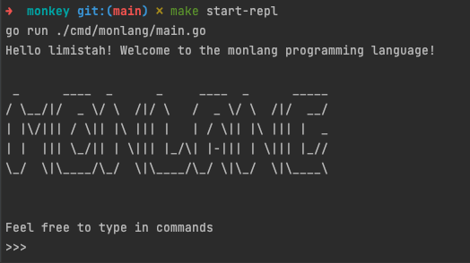

# MonLang

This is a HHLL written in Golang.

It follows the teachings from Thorsten Ball's book [Writing An Interpreter In Go](https://interpreterbook.com/).

## Syntax

## Compile the interpreter
Run `make build` to build an executable of the interpreter.

Run `./monlang -e 'print(1+1)'`

## Contributing
Please read the [contribution guide](./CONTRIBUTING.md).
